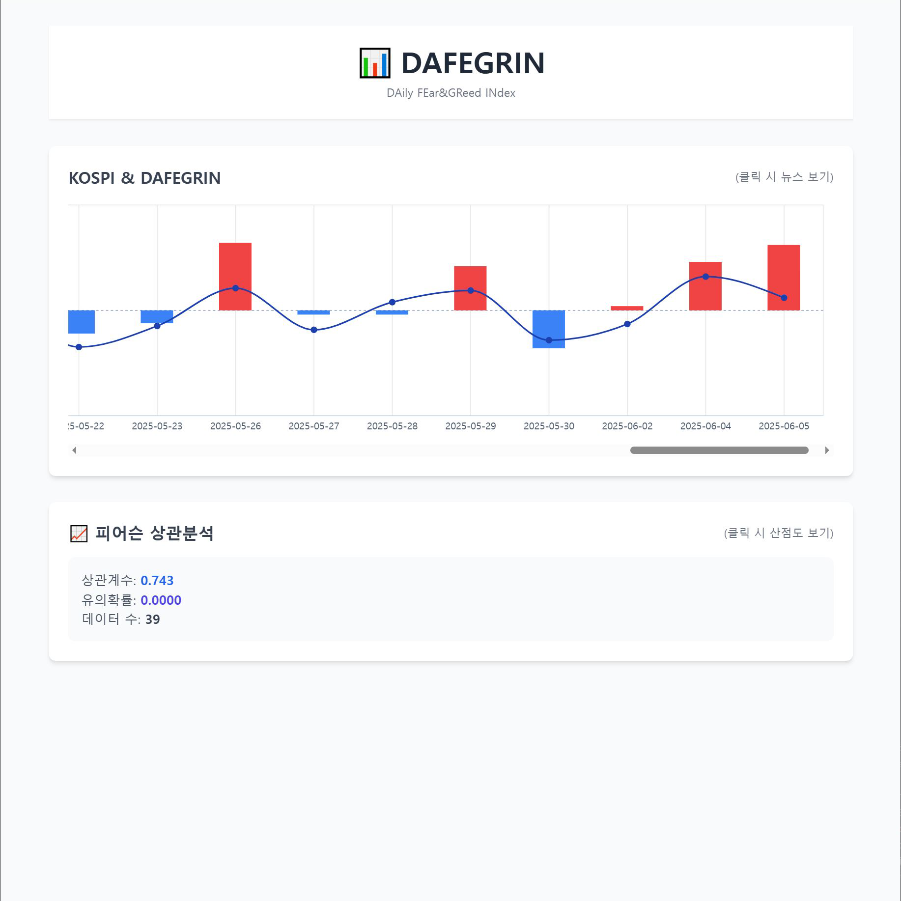
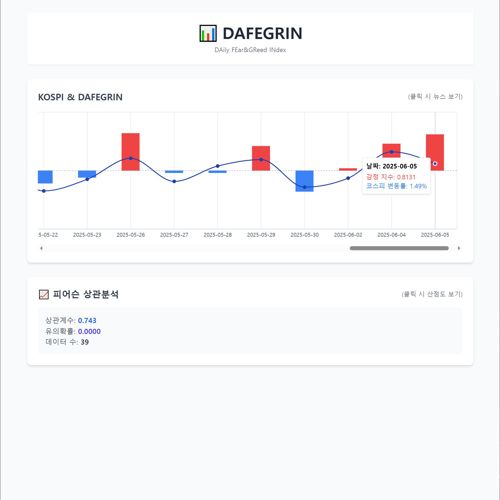
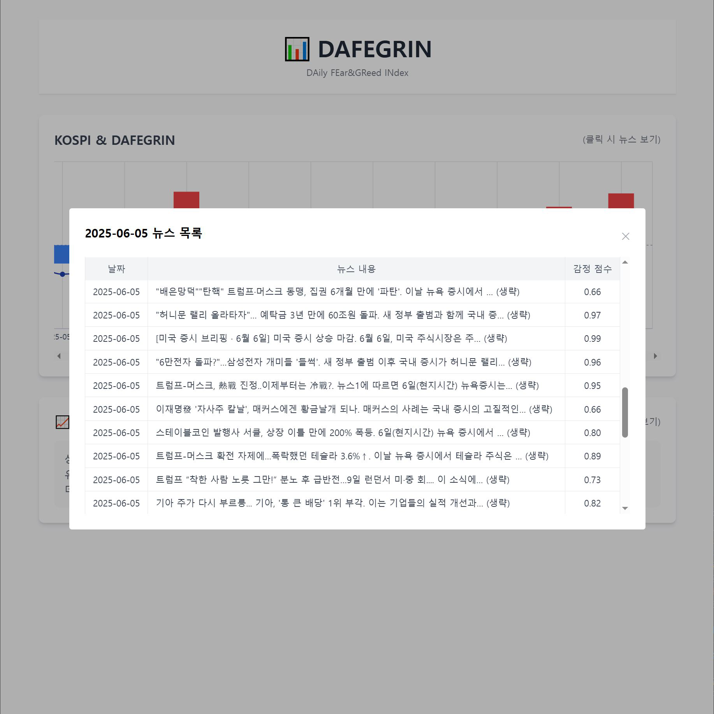
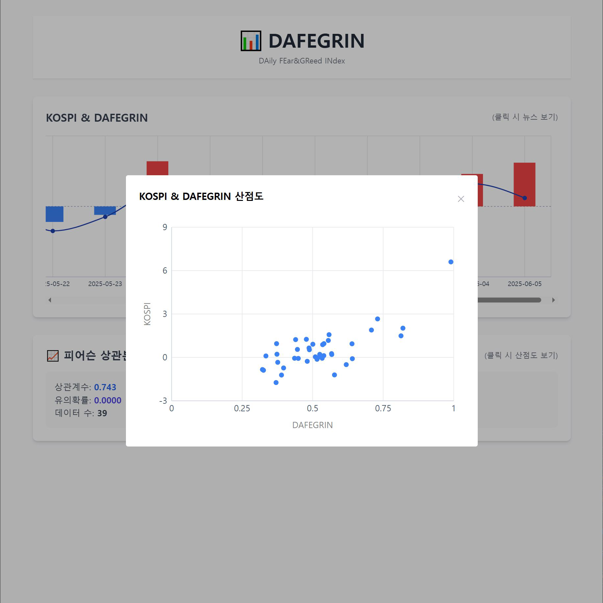
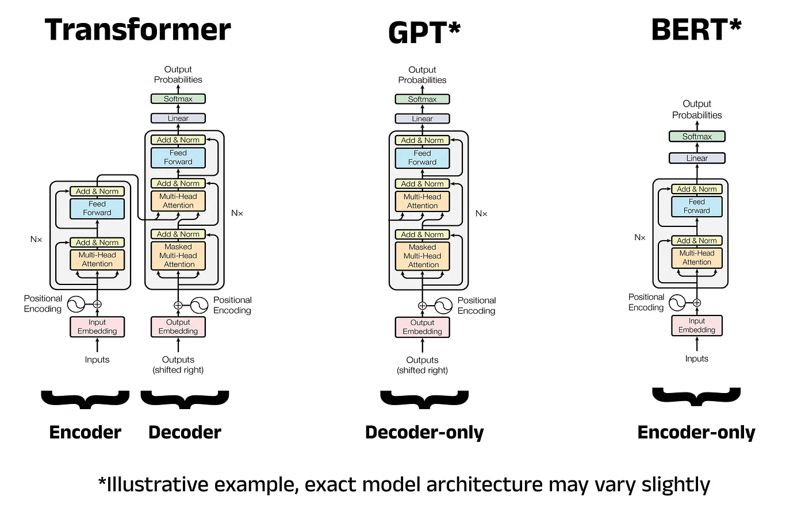

<div align="center">

<!-- logo -->


### DAILY FEAR&GREED INDEX :  AI 기반 일별 투자심리 예측 서비스
<br/> []()
<br/> []()

</div> 

## 📝 프로젝트 소개
주식투자를 할 때, 당일의 시장 흐름을 미리 예측할 수 있다면 얼마나 좋을까요?

**DAFEGRIN**(Daily Fear & Greed Index)은 이러한 투자자들의 니즈를 충족시키기 위해 **AI를 활용**하여 보다 효과적인 투자 결정을 돕는 서비스입니다.

전일 장 종료 후부터 당일 장 시작 전까지의 뉴스 기사 데이터를 수집하고, 이를 **KoBERT 모델을 기반으로 Fine-tuning한 AI 모델**을 통해 정밀한 **감정 분석**을 수행합니다.

이러한 감정 분석을 통해 얻어낸 **DAFEGRIN 지표로 당일의 투자심리를 예측**할 수 있으며, 예측 결과는 직관적으로 이해할 수 있도록 **도표로 시각화**됩니다.

또한, **DAFEGRIN** 지표와 실제 **KOSPI** 지수 간의 상관관계를 **Pearson 상관 분석**을 통해 제공하여 **분석결과의 신뢰도**를 투명하게 보여줍니다.

<br />

## 💻 화면 구성
|메인화면|메인화면 - 일별 코스피 & DAFEGRIN 지수|
|:---:|:---:|
|||


|뉴스 기사별 감정지수|피어슨 산점도 시각화|
|:---:|:---:|
|||

<br />

## 🦾 AI 모델 : KoBERT with NSMC (Fine-Tuning)



**BERT는** **Transformer** 모델의 **인코더** 구조만을 사용한 언어 모델입니다.

트랜스포머의 핵심인 **Self-Attention** 메커니즘을 통해 문맥을 양방향으로 이해할 수 있어, 문장의 의미를 보다 정확히 파악하는 데 강점을 가집니다.

**KoBERT는** 이 BERT 모델을 한국어에 맞게 학습시킨 버전으로 문장을 효과적으로 이해하며 **감정 분석, 문서 분류** 등 **한국어 자연어 처리 작업**에 특화되어 있습니다.

이에 더해 DAFEGRIN에서는 대표적인 한국어 감정 분석 데이터셋인 **NSMC**를 활용해 **KoBERT를 파인튜닝**하였습니다.

**NSMC**는 영화 리뷰와 그에 대한 **긍·부정 레이블**로 구성되어 있어 KoBERT가 문장 내 감정의 뉘앙스를 학습하는 데 적합한 데이터셋입니다.

<br/>

## 🛠️ 트러블 슈팅
### Fine-Tuning 과정
**1. Kobert 초기화** : 사용할 pre-trained 모델과, tokenizer 및 vocabulary를 가져옵니다.
```python
tokenizer = KoBERTTokenizer.from_pretrained('skt/kobert-base-v1')
bertmodel = BertModel.from_pretrained('skt/kobert-base-v1', return_dict=False)
vocab = nlp.vocab.BERTVocab.from_sentencepiece(tokenizer.vocab_file, padding_token='[PAD]')
```
**2. 데이터 전처리** : 학습에 사용할 데이터를 KoBERT 입력 형식에 맞게 전처리합니다.
```python
tok = tokenizer.tokenize
data_train = BERTDataset(dataset_train, 0, 1, tok, vocab, max_len, True, False)
data_test = BERTDataset(dataset_test, 0, 1, tok, vocab, max_len, True, False)
train_dataloader = DataLoader(data_train, batch_size=batch_size, num_workers=0)
test_dataloader = DataLoader(data_test, batch_size=batch_size, num_workers=0)
```
**3. 모델 정의** : KoBERT의 출력 결과를 입력으로 받아 이진 분류를 수행하는 BERTClassifier 모델을 정의합니다.
Dropout과 Linear 레이어를 통해 분류 작업에 적합하도록 구성합니다.
```python
class BERTClassifier(nn.Module):
    def __init__(self, bert, hidden_size=768, num_classes=2, dr_rate=None):
        ...
```
**4. 옵티마이저 및 스케줄러 설정** : 옵티마이저와 스케줄러를 사용해 학습률을 조절합니다.
```python
optimizer = AdamW(optimizer_grouped_parameters, lr=learning_rate)
scheduler = get_cosine_schedule_with_warmup(optimizer, num_warmup_steps=warmup_step, num_training_steps=t_total)
```
**5. 학습 및 평가 루프** : epoch만큼 모델을 학습하고 validation 데이터셋을 활용해 모델을 평가하고 가장 성능이 좋았던 모델을 저장합니다.
```python
for e in range(num_epochs):
    model.train()
    ...
    model.eval()
    ...
    if epoch_test_acc > best_test_acc:
        torch.save(model.state_dict(), 'kobert_finetuned.pt')
```

<br />

## ⚙ 개발 환경
### 🔭 Backend
- OpenJDK : 21.0.4
- gradle : 8.13
- IDE : IntelliJ

### 🦾 AI, ANALYZE

- Python : 3.7.0
- Pre-Trained Model : SKT/KoBERT(kobert-base-v1)
- Tokenizer : KobertTokenizer(kobert-base-v1)
- Fine-Tuning Dataset : Naver sentiment movie corpus v1.0

### 🖥️ Frontend
- Nodejs 22.5.1
- IDE : VSCode 1.95.1


### 🔐Database

- MariaDB 11.7
<br />
